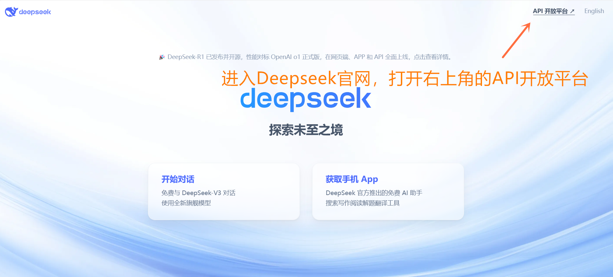

# DeepseekAPI
 
无三方产商推流，直接使用Deepseek API，用满血模型构建你自己的知识库。

1 在Deepseek官网申请API

1.1 打开Deepseek官网，https://www.deepseek.com/，进入API开放平台

1.2 在左侧API Keys标签内找到创建API Key按钮，点击创建APY Key

1.3 随意命名你的API Key，然后点击创建

1.4 复制并保存你的API Key

2 下载并安装Cherry Studio API 客户端

3 配置你的Deepseek API

3.1 Cherry Studio 安装完成以后，打开左下角的设置，然后找到Deep Seek厂商，