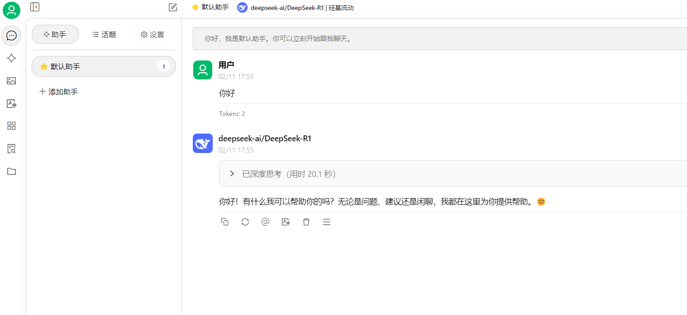

# 通过“硅基流动”+“Cherry Studio”接入Deepseek Api，使用满血R1推理模型和自定义知识库
 
## 1 获取硅基流动API Key

### 1.1 打开硅基流动官网 https://siliconflow.cn/zh-cn/ 注册账号+真人认证

硅基流动和华为云联合部署了Deepseek最新的R1 & V3模型，我们可以直接用硅基流动API来使用Deepseek最新模型，且一定程度上避免官方API的卡顿问题。

注册过程中可以填我的邀请码： BVjnIUhC，可以额外多获得2000万token的额度。

### 1.2 在左侧API Keys标签内找到创建API Key按钮，点击创建APY Key，随意命名你的API Key，然后点击创建，即可得到你的API Key

## 2 下载并安装Cherry Studio API 客户端，然后按照引导安装即可

## 3 配置你的硅基流动 API

### 3.1 Cherry Studio 安装完成以后，打开左下角的设置，然后找到硅基流动厂商，在对应位置键入刚才获得的密钥

注意不要泄露你的密钥。
右上角的硅基流动厂商开关属于打开状态。

### 3.2 键入完密钥以后可以用Deepseek R1模型测试连通性，没问题的话会有连接成功提示字样弹出

### 3.3 另外，在下方的管理界面中你可以选择添加或移除来选择使用更多的AI 模型

### 3.4 回到聊天界面，在聊天框顶部选择R1模型来进行对话，你能看到Deepseek的R1模型正在思考并回答问题

### 3.5 配置知识库，知识库需要添加嵌入模型，没有嵌入模型选项的，可以在设置->管理中选择添加

### 3.6 配置完成以后就可以给知识库喂文件了，以后聊天中可选择引用知识库来回答

以下示例是聊天中选择引用知识库来回答问题，其回复中已经引用了知识库中的文章。

